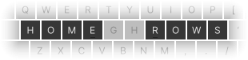

# homerows.nvim
##### I don't care what keyboard layout I'm using, I just want my keybinding on my homerows...

## problem
I don't know if you've noticed but qwerty is f***ing everywhere. I think it sucks 
so I opt for a alternate layout when I can.

But a big factor in my keybinding choices is that the letters are on the home rows
so when I switch between using vim on my laptop and my sick lightup keyboard this gets messed up.

If only there was a way to easily switch between keyboard layouts and keep my 
homerow keybindings. 

Then I thought, "I don't make the rules but I do make shitty nvim plugins."

