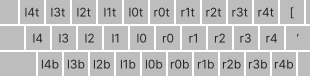
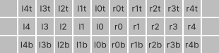

<div align="center" width="200%">


# homerows.nvim
##### I don't care what keyboard layout I'm using, I just want my keybinding on my homerows...

</div>

## problem
I don't know if you've noticed but qwerty is f***ing everywhere. I think it sucks 
so I opt for a alternate layout when I can.

I put most of my keybindings on my homerows for convenience but when I switch 
between my laptop and my sick lightup colemak-dh keyboard, things gets messed up.

If only there was a way to easily switch between keyboard layouts *and* keep my 
homerow keybindings. 

Then I thought, "I don't make the rules but I do make shitty nvim plugins."

## homerows

Homerows allows you to map your keybindings to the position of the key and not the
letter making it impeccably easy to maintain your keybinding positions across various 
keyboard layouts.

The key positions follow the diagrams below, with the naming convention:
<br> HAND - FINGER - VERTICALITY

<div style="display: flex; gap: 16px; flex-wrap: wrap; margin-bottom: 1rem;">
<div style="display: flex; flex-direction: column; flex: 1 300px;">

**staggered layout**


</div>

<div style="display: flex; flex-direction: column; flex: 1 300px;">

**columnar layout**


</div>
</div>

The middle row drops the VERTICALITY indicator for brevity's sake as it is default.

To capitalise the letter, making the HAND portion capital.

| name | hand | finger | vert | qwerty | colemak | 
| --- | --- | --- | --- | --- | --- | 
| l0 | left | first | middle | g | g | 
| r3t | right | third | top | o | y | 
| L1b | left | first | bottom | V | D | 

```lua
local hr = require("homerows.homerows")

vim.keymap.set(
  'n', 
  '<leader>' .. hr.l3 .. hr.R1b,
  function() do_stuff() end,
  { desc = "does things" }
)
```
## install

Use a package manager of your choice; examples using common one below. Requires
plenary.nvim.

### [Packer](https://github.com/wbthomason/packer.nvim)
```lua 
use {
  "kbario/homerows.nvim",
  requires = {"nvim-lua/plenary.nvim"} -- if you don't have it already
}
```

### [Plug](https://github.com/junegunn/vim-plug)
```vim
Plug "nvim-lua/plenary.nvim" " if you don't have it already
Plug "kbario/homerows.nvim"
```

## settings

global settings of homerows that are set on setup:

```lua
settings = {
  -- used to give preference to ripples. see ripples below.
  pref = { "programmers_dvorak", "colemak_dh" }
  -- whether or not to add the keybinding for changing the current homerows layout
  add_change_keymap = true,
  -- whether or not to add the keybinding for printing the current homerows layout
  add_print_keymap = true
  -- where you add layouts that don't come standard with homerows.
  custom_layouts = {
    your_layout = {
      r1 = "a",
      r2 = "b",
      ...
    }
  }
}
```

## preconfigured layouts

Current layouts that come with homerows include 

- qwerty
- dvorak
- programmers dvorak
- colemak
- colemak-dh

Add your own in the custom layouts attribute of the [global settings](#settings) 
object. Find a premade custom_layouts object [below](#custom_layouts-object) to 
copy and paste into your config to save time.

If you think there's a layout that should come standard with homerows, make a 
<a href="https://github.com/kbario/homerows.nvim/pulls" target="_blank">PR</a>. 

## commands

### :HomerowsTo

This command changes the keyboard layout that homerows is using to determine the
what keys are in what positions. Either type the layout you're using (i.e. qwerty, 
colemak, etc.) or you can use a [ripple](#ripples) (i.e. asdf, arst, etc.).

Enable or disable the default keybinding for this command - `"<leader>hrt"` - with 
```lua
add_change_keymap = true/false
```
in the [setup of homerows](#settings).
Or use another keybinding by supplying the mapping as the value (i.e. 
```lua 
add_change_keymap = '<leader> .. hr.l1t .. hr.l2t'
```

### :HomerowsAre

forgot what keyboard layout you're using? `"<leader>hra"` prints this in the bottom bar, or change it in the [setup](#settings). 

## ripples


**at present, this does not reload your neovim so you will need to restart for the changes to take effect.**
If you know how to do this, please make a pull request to change it.


## custom_layouts object
